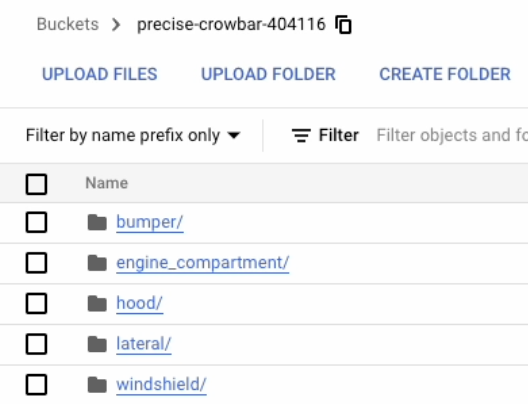
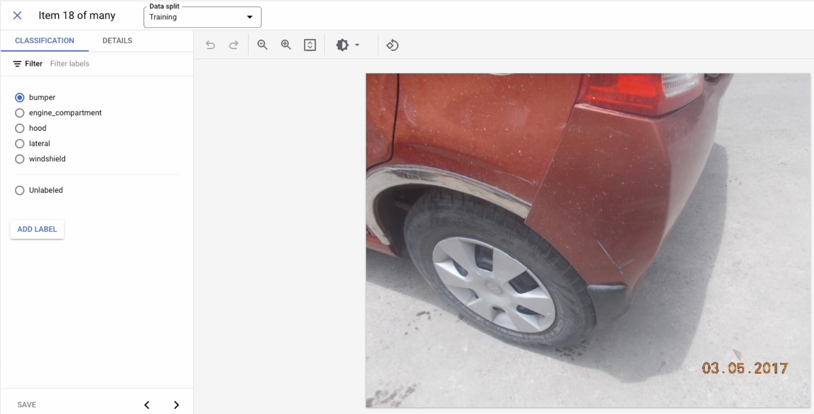
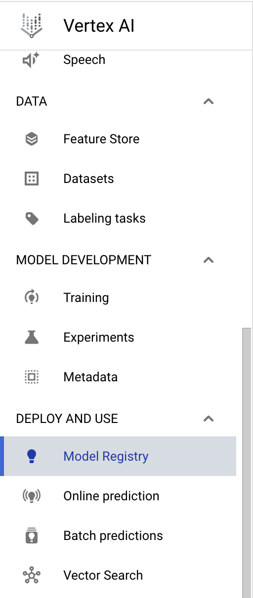
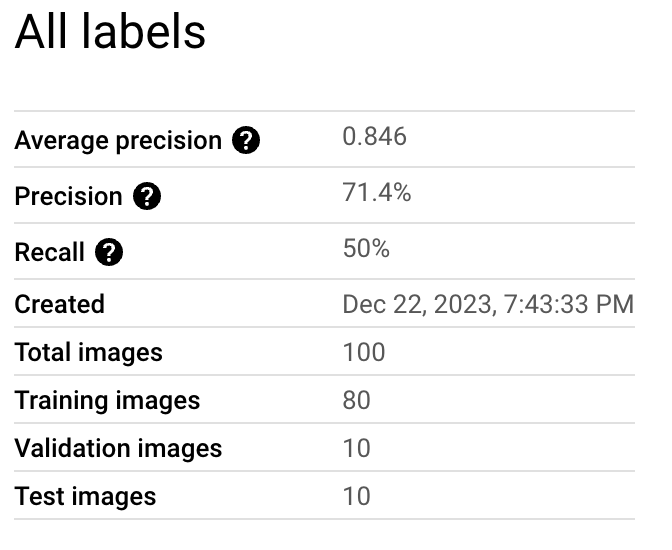
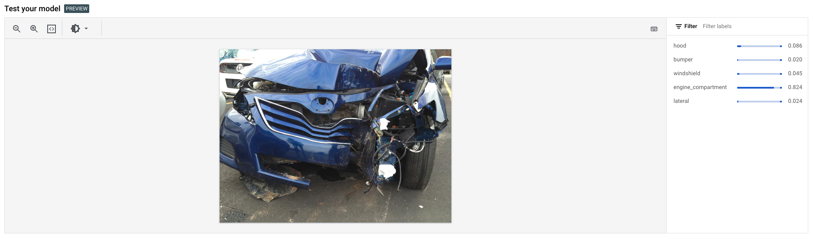
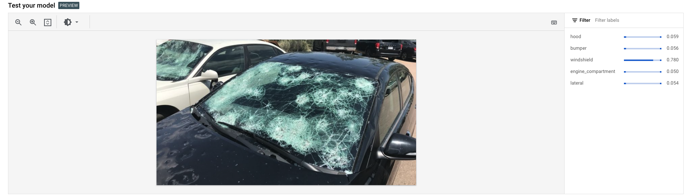
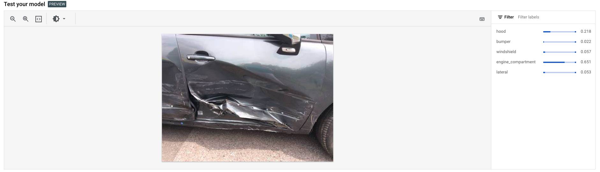
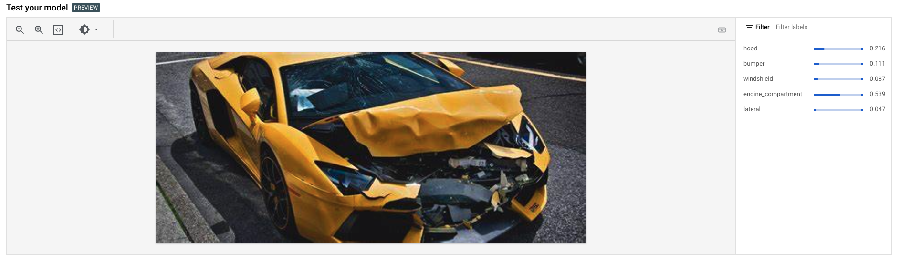

# Identify Damaged Car Parts with Vertex AutoML Vision 
A **custom ML model** I created that automatically recognizes damaged car parts with the help of Google Cloud Self-Paced Labs.  

I used Google Cloud Platform's (GCP) Vertex AI to train a model on a dataset containing images of damaged car parts.

---
The model can classify the images of damaged car parts into the following:  
* Bumper
* Engine compartment
* Hood
* Lateral
* Windshield
---

You can follow the steps below to reproduce the model in GCP:

[1. Creating a Cloud Storage Bucket](#1-creating-a-cloud-storage-bucket)  
[2. Upload car images to your Storage Bucket](#2-upload-car-images-to-your-storage-bucket)  
[3. A tad bit of Cleaning](#3-a-tad-bit-of-cleaning)  
[4. Create a Vertex AI Dataset](#4-create-a-vertex-ai-dataset)  
[5. Upload images of damaged car parts to the Dataset](#5-upload-images-of-damaged-car-parts-to-the-dataset)  
[6. Inspect Images](#6-inspect-images)  
[7. Train your model](#7-train-your-model)  
[8. Results and Testing](#8-results-and-testing)  

## Get Started!

### 1. Creating a Cloud Storage Bucket

Once you've logged into GCP conolse, **set** global environment variables `PROJECT` & `BUCKET` by running the following commands in  an **Active Cloud Shell** window (found on the top right):

```bash
export PROJECT_ID=$DEVSHELL_PROJECT_ID
export BUCKET=$PROJECT_ID
```
Now let's **create** a Cloud Storage Bucket by using the `gsutil` command in the shell window:


```bash
gsutil mb -p $PROJECT_ID -c standard -l "REGION" gs://${BUCKET}
```

> [!IMPORTANT]  
> This uses the `gsutil` command to make a bucket (`mb`) of a `standard` storage class in the current `REGION` under the given project (provided its ID: `$PROJECT_ID`). In `gs://${BUCKET}`, `gs://` is the Google Cloud Storage scheme and `${BUCKET}` is the name of our bucket. In this case, I'm using the project name as the bucket name - you can choose not to, but make sure to update the `BUCKET` variable using the `export` command.

Our Storage bucket is ready, so it's time to get our dataset!

---
### 2. Upload car images to your Storage Bucket

We'll be using a simple `gsutil` copy command to do this:

```bash
gsutil -m cp -r gs://car_damage_lab_images/* gs://${BUCKET}
```
We recursively copy the folder `car_damage_lab_images` to our Storage Bucket.



---
### 3. A tad bit of Cleaning 

We will now create a Dataset for Vetex AI to use in training our model!

But before we do that we must first clean it a little.

First, let's copy `data.csv` to our current directory in the Shell window by running the command below so we can work with it:

```bash
gsutil cp gs://car_damage_lab_metadata/data.csv .
```

> [!IMPORTANT]
> `data.csv` contains the file path to our images so Vertex AI can locate them; however, the parent directory has changed to our Storage Bucket, so we must update that in the csv file as well.

Run the following `sed` command to subsitute the parent directory of the images with our Storage Bucket:

```bash
sed -i -e "s/car_damage_lab_images/${BUCKET}/g" ./data.csv
```

Now let's copy the altered `data.csv` to our Storage Bucket:

```bash
gsutil cp ./data.csv gs://${BUCKET}
```

Check that `data.csv` is in the Storage Bucket by refreshing it (There's a button for it on the page!).

Then off we go to make our Dataset!!

---

### 4. Create a Vertex AI Dataset

First let's enable some APIs (boring):

1. Open <span style="color:DodgerBlue">**Vertex AI**</span> > <span style="color:DodgerBlue">**Dashboard**</span> by finding it in the Side Menu (you might need to open the "More Products" dropdown).
2. Click <span style="color:DodgerBlue">**Enable All Recommended APIs**</span> on the page.

> [!WARNING]
> The GCP interface is constantly changing so this might not be exact way to enable the APIs or Create the Dataset (or in general), but you can find out by simply googling.

With that out of the way, let's make the Dataset (finally!):

3. From the <span style="color:DodgerBlue">**Vertex AI**</span> navigation menu on the left, click <span style="color:DodgerBlue">**Datasets**</span>.
4. At the top of the console, click <span style="color:DodgerBlue">**+ Create**</span>.
5. For Dataset name, type `damaged_car_parts` or one of your choice.
6. Select <span style="color:DodgerBlue">**Image classification (Single label)**</span> & click <span style="color:DodgerBlue">**Create**</span>.

Time to upload some images, yay!

---

### 5. Upload images of damaged car parts to the Dataset

Let's connect the images we copied to our dataset!

1. In the <span style="color:DodgerBlue">**Select an import method**</span> section, click <span style="color:DodgerBlue">**Select import files from Cloud Storage**</span>.
2. In the <span style="color:DodgerBlue">**Select import files from Cloud Storage**</span> section, click <span style="color:DodgerBlue">**Browse**</span>.
3. Follow the prompts to navigate to your storage bucket and click your `data.csv` file. Click <span style="color:DodgerBlue">**Select**</span>.
4. Once you see a <span style="color:ForestGreen">green</span> checkbox to the left of the file path, click <span style="color:DodgerBlue">**Continue**</span>.

> [!NOTE]
> Uploading can take around 10 minutes!

---

### 6. Inspect Images

Some images might be labled incorrectly, so let's correct them if they are.

Go to the <span style="color:DodgerBlue">Browse</span> tab, and verify that all are correctly labaled correctly. If not simply click on them and change the lable on the right side.



It's about time we train our Model!!

https://github.com/pandu-0/Damaged-Car-Parts-Recognition-ML-Model/assets/89210693/38d40f4a-8d84-46bf-a889-e8369f3552cc


---

### 7. Train your model

Now that we have our Dataset ready, we can begin training our model.

Click on the <span style="color:DodgerBlue">**Analyze**</span> tab (next to Browse), and click <span style="color:DodgerBlue">**Train New Model**</span> found on the right side and follow the video below.

<video width="320*3" height="240*3" controls>
    <source src="./assets/train-model.mp4" type="video/mp4">
</video>


https://github.com/pandu-0/Damaged-Car-Parts-Recognition-ML-Model/assets/89210693/c0689f05-6653-4d67-b8ad-3f55bfb008f6


Click <span style="color:DodgerBlue">**Start Training**</span> to begin training! - took me 2 hours :((

>[!IMPORTANT]
> We choose the **AutoML** option so GCP's Vertex AI automatically chooses Machine Learning Algorithms to create a custom model for us. **High Accuracy** was chosen for, well, high accuray - and lower latency. **Node hours** is the amount of time we allot to the machine to complete our job.

---

### 8. Results and Testing
Once your model has finished traning (you'll probably get an email), you can find it in the side menu by opening <span style="color:DodgerBlue">**Vertex AI**</span> > <span style="color:DodgerBlue">**Model Registry**</span> (under `Deploy And Use` section). **Click** on your <span style="color:DodgerBlue">**model**</span> to view details.



You can check your model precision and recall in the <span style="color:DodgerBlue">**Evaluation**</span> tab on the top.

These are mine:



Switch to the <span style="color:DodgerBlue">**Deploy & Test**</span> tab and click <span style="color:DodgerBlue">**Upload Image**</span> to start making predictions!! Your image can be any damaged car (but make sure they are image files like png & jpg).

Here are some of mine:






We can see the classification probabilities on the right side.

At last, we have completed making a **cutom ML model** using **Vertex AI AutoML Vision** in GCP.

Thank you for reading :))


